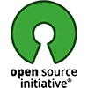
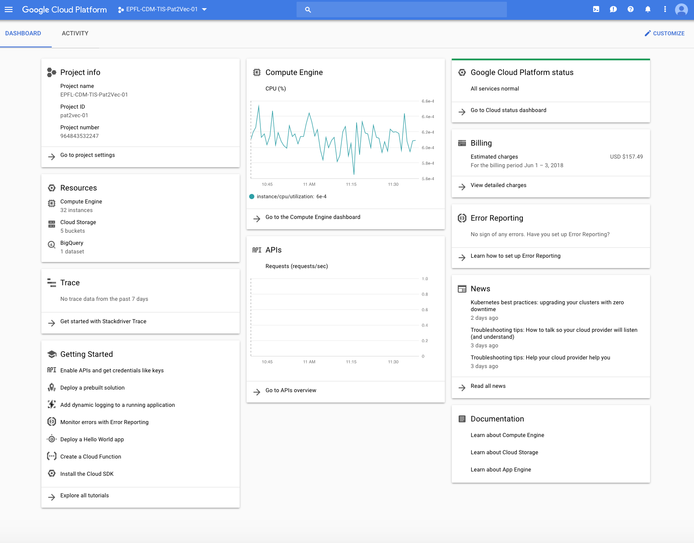
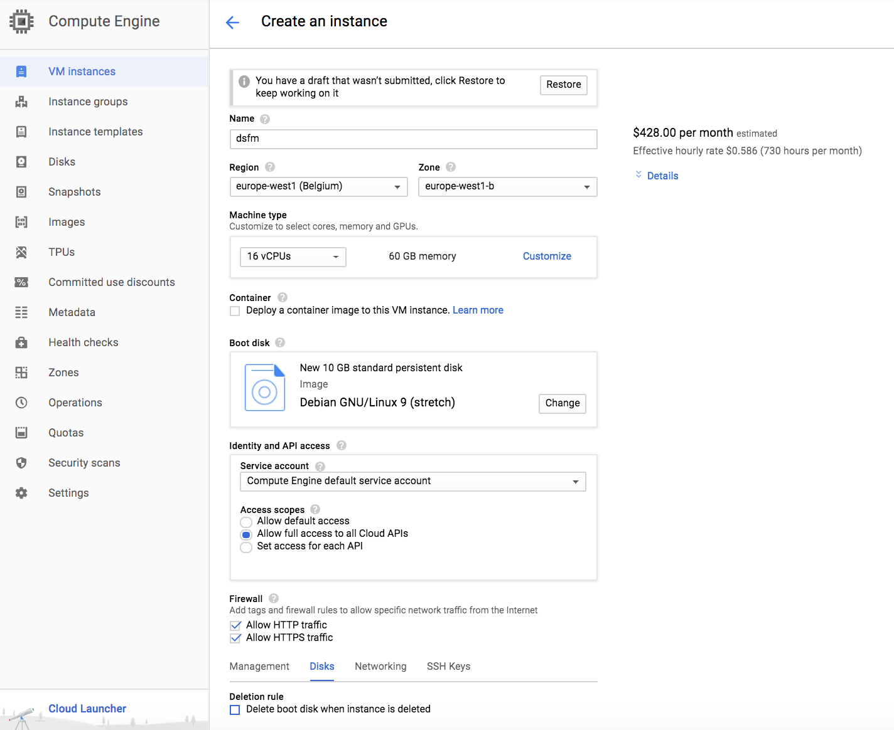
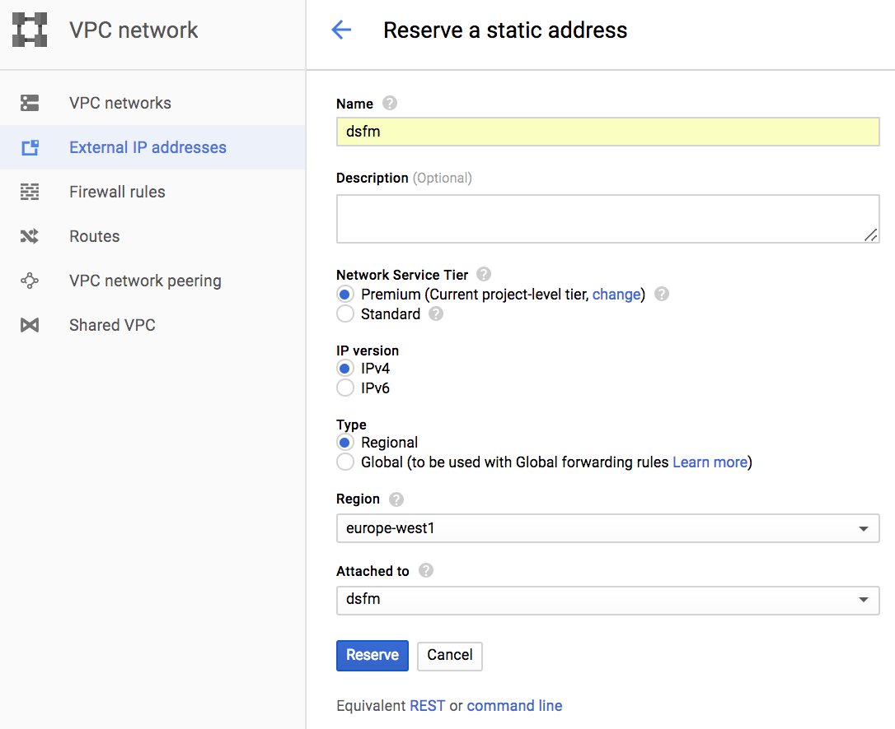
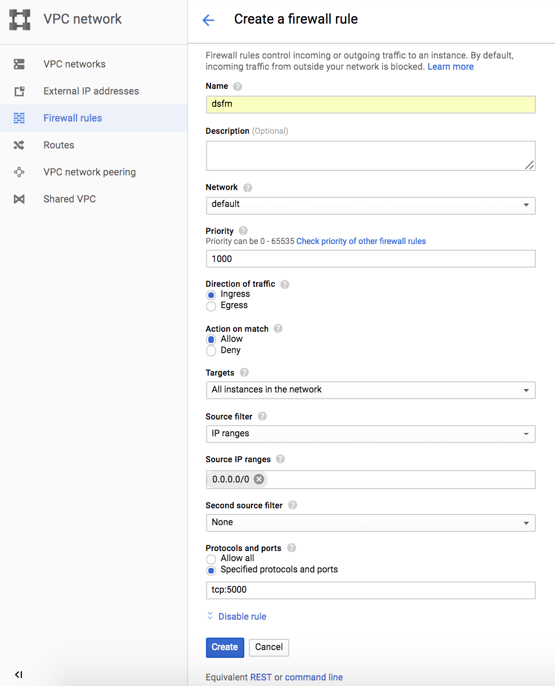
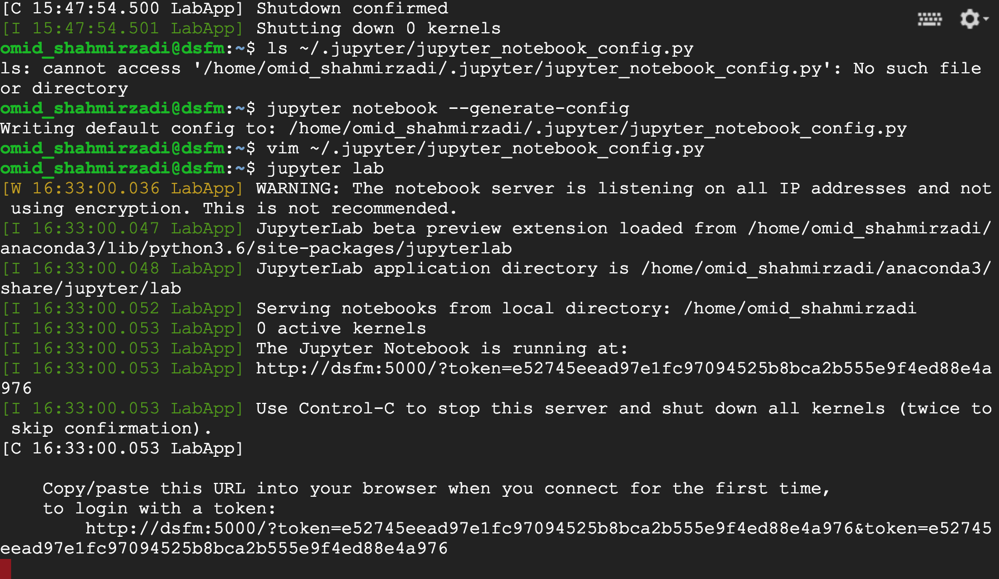

# DSFM Code Bank - Readme

Source:  [https://github.com/dsfm-org/code-bank.git](https://github.com/dsfm-org/code-bank.git)  
License: [MIT License](https://opensource.org/licenses/MIT). See open source [license](LICENSE) in the Code Bank repository. 

## Overview

The [Data Science for Managers Program](https://www.dsfm.org) open sources, under an [MIT License](LICENSE), all of code used in the demos, exercises, illustrations, projects, and workshops of a participating DSFM program. You may access, download, clone, and potentially collaborate on these materials by contributing to the [DSFM GitHub Code Bank](https://github.com/dsfm-org/code-bank.git) repository. Please see [contributing](CONTRIBUTING.md) for more information on how to contribute to this open source initiative. 

  

## Installation

1. Install Python 3.7.

    Download an install [Anaconda Python 3.7](https://www.anaconda.com/download/).

2. Install the Python modules listed in requirements.txt.

    `pip install -r requirements.txt`  

3. Clone the DSFM Code Bank from GitHub.

    `git clone https://github.com/datascienceformanagers/dsfm-code-bank.git`

## Execution

Most of the code is written to execute in a [Jupyter Lab](https://jupyter.org/) notebook through a standard web-browser. Therefore, most any kind of computer will work (even a Chromebook) provded that the back-end Jupyter Server is setup and configured with Python 3.x and [the requirements](REQUIREMENTS.txt). The more advanced programs may require a computer with additional memory, processors, GPUs/TCUs, a Spark cluster, or other resources as indicated in the file. For that reason, we recommend students to provision and use a virtual machine (VM) for running their code remotely. We provide instructions below as to how to do so on the [Google Compute Platform](https://cloud.google.com/).

#### Running the Code Bank on a VM on Google Cloud

You can use the DSFM Code Bank on any computer where you have installed it as described above. Many students, however, prefer to use the Code Bank on a virtual machine running remotely that may be more powerful than their local computer, and/or which can be started/stopped/backed-up and so on remotely. To setup a VM on the Google Cloud Platform, follow the instructions below. You can use a VM on another platform by modifiying the instructions as needed.

#### Step 1: Create an Google Cloud Platform account.  

Start a [Google Cloud Platform](https://cloud.google.com/) (GCP) account and log into your console.

#### Step 2: Create a project.  

From the main dashboard, create a new GCP project.

#### Step 3: Create and configure a virtual machine.

Create a new virtual machine (VM) by clicking on **Main Menu -> Compute Engine -> VM instances** and Create a new instance. Configure the location, hardware specifications (CPU / GPU, RAM, Hard Disk), Operating System, and other settings of the machine when you create it. The price of the machine per month is displayed on the right panel.

#### Step 4: Create a static IP address.

You will want to set an static external IP address for your VM so that you can always access it at that address (reserving a static IP, however, does cost more). To do so, click on the **VPC network -> External IP addresses** from the main console menu. Once you have reserved a static address, you will then need to connect it to the virtual machine "instance" that you created earlier by selecting the VM under "Attach to." 

#### Step 5: Change the firewall.

By default, external traffic to your virtual machine will be blocked, so you will need to enable external access to your instance through port 5000 and the TCP protocol.

To enable such access, click on the **VPC network -> Firewall rules** from the main console menu, click on **Create** a firewall rule, and fill out the red parts as shown.
 

 
#### Step 6: Start your virtual machine and access it through SSH.

Select your machine from **Main Menu -> Compute Engine -> VM instances** and start it. Once it is up and running, you can then access the VM through an SSH terminal by clicking on the SSH option listed with the machine.

#### Step 7: Install Anaconda Python 3.7 and supporting modules.

As your VM is probably running Linux, you may need to install Anaconda Python manually. The following instructions worked for us 
	
	apt-get update
	apt-get upgrade
	apt-get install git
	
	sudo su
	wget https://repo.continuum.io/archive/Anaconda3-5.2.0-Linux-x86_64.sh
	apt-get install bzip2
	bash Anaconda3-5.2.0-Linux-x86_64.sh
	source /root/.bashrc
	
	pip install -r requirements.txt
	
	pip install google-compute-engine --ignore-installed      # required for proper installation of gensim
	conda install -c conda-forge gensim 
	conda install -c conda-forge tensorflow                   # install before keras as default backend
	conda install -c conda-forge keras
	apt-get install graphviz                                  # needed for keras model visualization
	conda install -c conda-forge xgboost 
	conda install -c conda-forge plotly 
	conda install -c conda-forge networkx
	conda install -c conda-forge lightgbm
	conda install -c conda-forge textblob
	conda install -c conda-forge scikit-optimize
	conda install -c conda-forge scrapy
	conda install -c conda-forge nodejs
	conda install -c conda-forge pydot 
	conda install -c conda-forge basemap
	conda install -c conda-forge folium  
	conda install -c conda-forge spacy 
	conda install -c conda-forge scikit-image
	conda install -c conda-forge wordcloud
	apt-get install enchant
	pip install pyenchant
	apt-get install unzip  

### Step 8: Setup Jupyter Lab server

Convert your virtual machine to a Jupyter Lab server to access it remotely. First generate a configuration file using:

**`jupyter notebook --generate-config`**
 
Next open the configuration file with your favourite editor (e.g. *vim*):

**`vim /root/.jupyter/jupyter_notebook_config.py`**

Add the following four lines in the jupyter_notebook_config.py file:

	c = get_config()
	c.NotebookApp.ip = '*'
	c.NotebookApp.open_browser = False
	c.NotebookApp.port = 5000

Install any of the Jupyter Lab extensions that you think you will use. For example:

**`jupyter labextension install jupyterlab_bokeh`** 

Run the Jupyter Lab server using the following command:

**`jupyter lab`**

This will run a Jupyter Lab server on the earlier specified port (e.g. 5000) so you can access it remotely.

### Step 9: Connect to your Jupyter Lab server

Copy the link printed by the console after starting the Jupyter Lab server (where it says "Login with a token:") and past it into the URL Address box on your web browser. 

### Step 10: Clone the DSFM Code Bank

In Jupyter Lab, open a new Linux Terminal: **File -> New -> Terminal**

Then clone the repository by executing the following command into the terminal:

`git clone https://github.com/dsfm-org/code-bank.git`

### You are Ready to Go!

You now are ready to start working with the Code Bank on a Google VM.
